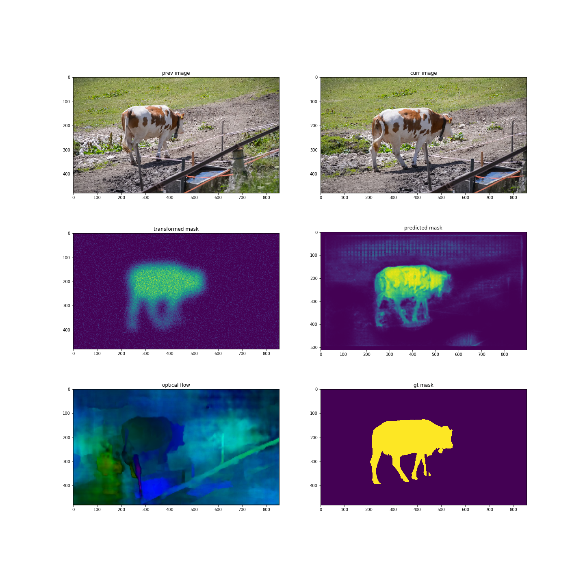

# Multiple Video Instance Object Segmentation and Tracking

## Overview
The goal of this model is to segment multiple object instances from both video
and still images and track (identify) objects over consecutive frames. There are
3 major modules:
* Image Segmentation Module
  * Mask R-CNN
* Identification Module
  * Triplet Network
  * FAISS Database
* Mask Refine Module
  * PWC-Net
  * U-Net

## Instructions for Use
This project was developed on Python 3.6, Tensorflow 1.11, Keras 2.1, and Numpy 
1.13. To ensure full compatibility, use these versions (but it may work with
other versions).

### 1. Install dependencies
If you are on the shared Google instance (for UMD FIRE COML), there is already a conda virtual env 
with the correct dependencies. To start it, run 
```bash
source activate multiseg
```

Otherwise, run the setup.py script, which will also install the dependencies for this
project (using pip):
```bash
python setup.py install
```

If the script fails, you may have to manually install each dependency using pip
(pip is required for some dependencies; conda does not work).

### 2. Acquire datasets
#### Download datasets
You can acquire the full
[DAVIS 2017](https://davischallenge.org/davis2017/code.html) and full 
[WAD CVPR 2018](https://www.kaggle.com/c/cvpr-2018-autonomous-driving/data)
datasets at their respective sources, but we also have a "mini-DAVIS" and a 
"mini-WAD" dataset that has the same folder structure but only contains a very 
small subset of the images--which allows for easier testing and evaluation.

* For **CVPR WAD 2018**, there is only the 'train' subset (and only certain images
within the subset).

* For **DAVIS 2017**, there is only the 'trainval' subset at 480p resolution 
(and only some of the images/videos within the subset).

The mini-datasets can be found on our github repository's
[releases page](https://github.com/umd-fire-coml/MultiSeg/releases). We are 
currently on release version 0.1.

#### Expected Data Directory Structures
As a quick check, make sure the following paths exist (starting from the root 
data directory):

**CVPR WAD 2018**: `.\train_color\`

**DAVIS 2017**: 
`.\DAVIS-2017-trainval-480p\DAVIS\JPEGImages\480p\blackswan\`

### 3. Download pre-trained weights
Currently, we have released pre-trained weights for the following modules only:
* Image Segmentation
  * Default Directory: `.\image_seg`
* Optical Flow
  * Default Directory: `.\opt_flow\models\pwcnet-lg-6-2-multisteps-chairsthingsmix`
  * *Note*: these weights are saved as a tensorflow checkpoint, so you will need
  to place all 3 files in this directory
* Mask Refine (coarse only)
  * Default Directory: `.\mask_refine`

As with our mini-datasets, the weights binaries for the image segmentation and
mask refine modules can be found on our github repository's
[releases page](https://github.com/umd-fire-coml/MultiSeg/releases).

For the optical flow model weights, you can find the latest versions
[here](http://bit.ly/tfoptflow) (make sure to download the one that matches the 
directory name specified above).

### 4. Run a demo inference script
#### Instance Segmentation (Matterport implementation of Mask R-CNN)
Notebook: [Instance Segmentation Notebook](demo_image_seg.ipynb)

Dataset: CVPR WAD 2018

#### Mask Refine
Notebook: [Mask Refine Demo Notebook](demo_mask_refine.ipynb)

Dataset: DAVIS 2017

#### Instance Identification
See separate repository. 

## Examples

Coarse Mask Refine Inputs and Outputs
