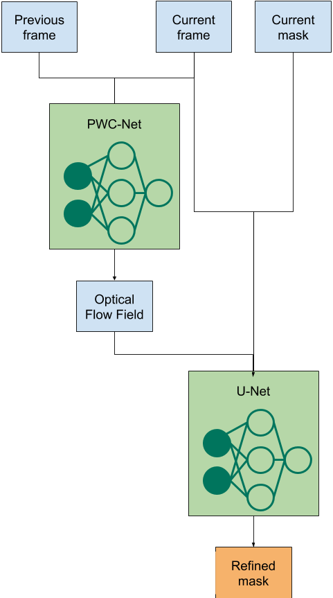

# Mask Refine

## What this module does

The Mask Refine module is responsible for estimating the location of the mask for an object in the
current frame given the previous frame, current frame, and the output of Mask-RCNN on the current frame.

The model flows as follows:
1. Runs the previous image and the current image through a PWC-Net to get the optical flow field
from the previous image to the current image.
2. Runs the current image, the optical flow field, and a predicted mask for a specific object from the
current image through a U-Net to get the refined mask the same object in the current image.

Here is a diagram of the process:

## What this directory contains
* [Mask Refine](./mask_refine.py) - Current Mask Refine module
* [Mask Propagation](./mask_propagation.py) - Old Mask Refine module - DO NOT USE - it is here for reference
* [__init__.py](./__init__.py) - Just there for Python packaging
* [README.md](./README.md) - This file!

## What to do BEFORE using this directory

Make sure to download the [ROOT](https://github.com/umd-fire-coml/MultiSeg) directory as this module
relies on modules outside of this directory. 

Run the [setup script](../setup.py) - this will install from [requirements.txt](../requirements.txt)
Note: this module does not need any additional dependencies - this module works
if the requirements.txt in the root directory are all installed via the setup.py script.

## How to run the demo

Open the [demo_mask_refine.ipynb](../demo_mask_refine.ipynb) notebook and run block by block!
Note: the notebook is in the root directory of the repository because it needs access to files
outside of this directory.